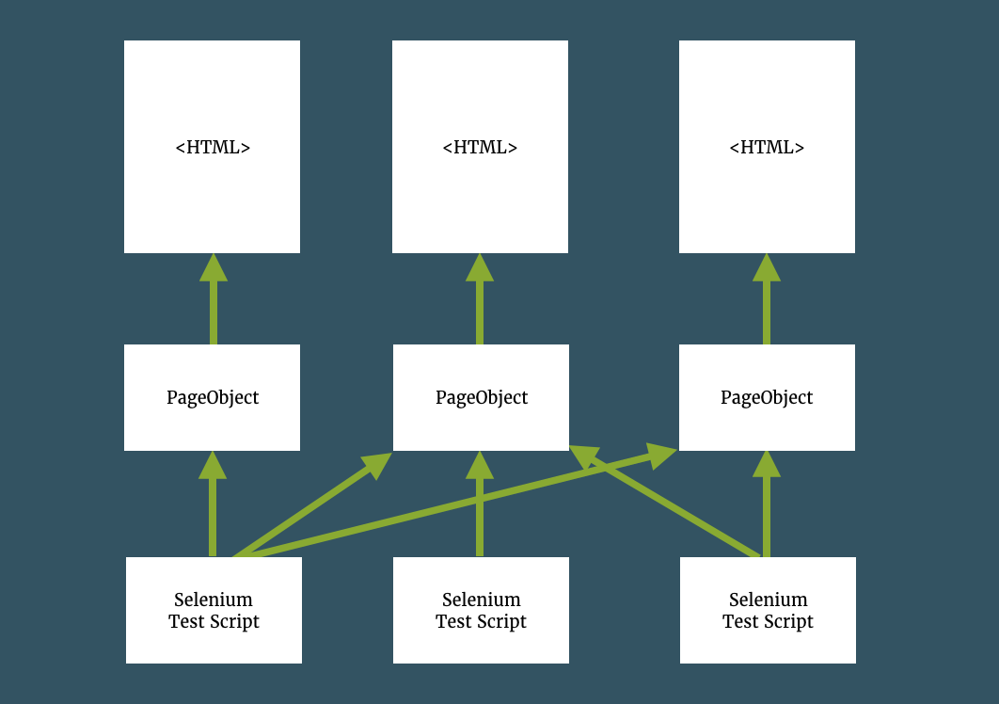

[](https://youtu.be/Wgyffk7hJQw)

Carina framework follows Selenium best practices for web tests automation. If you are familiar with Selenium WebDriver and have already implemented few tests with Page Object pattern the following guide will be pretty much easy for understanding. We have chosen [GSM Arena](https://www.gsmarena.com/) public web site for demonstration purposes, all the test source code is located in [carina-demo](https://github.com/qaprosoft/carina-demo) Github repo.


### Implementation of Page Objects
When you are writing functional tests using Selenium a major part of your code will consist of interactions with the web interface you are testing through the WebDriver API. After fetching elements you will verify some state of the element through various assertions and move on to fetching the next element. You may find WebElements directly in your tests:
```
List<WebElement> zipCodes = driver.findElements(By.id("zipCodes"));
for (WebElement zipCode : zipCodes) {
    if (zipCode.getText().equals("12345")){
        zipCode.click();
        break;
    }
}
WebElement city = driver.findElement(By.id("city"));
assertEquals("MyCityName", city.getText());
```
So some of the typical problems for this type of Selenium test are:

* Test cases are difficult to read
* Changes in the UI breaks multiple tests often in several places
* Duplication of selectors both inside and across tests - no reuse

So instead of having each test fetch elements directly and being fragile towards UI changes, the Page Object Pattern introduces what is basically a decoupling layer. 

You create an object that represents the UI you want to test, which could be a whole page or a significant part of it. The responsibility of this object is to wrap HTML elements and encapsulate interactions with the UI, meaning that this is where all calls to WebDriver will go. This is where most WebElements are. And this is the only place you need to modify when the UI changes.



In general Page Object contains locators of the elements located on the page and some business logic that may be reused by different tests:
```
public class ModelInfoPage extends AbstractPage {
    @FindBy(css = ".help-display strong")
    private ExtendedWebElement displayInfoLabel;

    @FindBy(css = ".help-camera strong")
    private ExtendedWebElement cameraInfoLabel;

    @FindBy(css = ".help-expansion strong")
    private ExtendedWebElement displayRamLabel;

    @FindBy(css = ".help-battery strong")
    private ExtendedWebElement batteryInfoLabel;

    public ModelInfoPage(WebDriver driver) {
        super(driver);
    }

    public String readDisplay() {
        assertElementPresent(displayInfoLabel);
        return displayInfoLabel.getText();
    }

    public String readCamera() {
        assertElementPresent(cameraInfoLabel);
        return cameraInfoLabel.getText();
    }

    public String readRam() {
        assertElementPresent(displayRamLabel);
        return displayRamLabel.getText();
    }

    public String readBattery() {
        assertElementPresent(displayInfoLabel);
        return batteryInfoLabel.getText();
    }
}

```
**Important:**

* Page should extend **com.qaprosoft.carina.core.gui.AbstractPage**
* Use **com.qaprosoft.carina.core.foundation.webdriver.decorator.ExtendedWebElement** instead of Selenium WebElement
* Locate Page Object classes in src/main/java


### Implementation of UI Components
In some cases it is useful to implement UI Objects that may be reused between multiple Page Objects, for top menu or footer instance may be shared between multiple pages:
```
public class FooterMenu extends AbstractUIObject {
    @FindBy(linkText = "Home")
    private ExtendedWebElement homeLink;

    @FindBy(linkText = "Compare")
    private ExtendedWebElement compareLink;

    public FooterMenu(WebDriver driver, SearchContext searchContext) {
        super(driver, searchContext);
    }

    public HomePage openHomePage() {
        homeLink.click();
        return new HomePage(driver);
    }

    public CompareModelsPage openComparePage() {
        compareLink.click();
        return new CompareModelsPage(driver);
    }
}
```
And then you can use that in Page Object:
```
public class HomePage extends AbstractPage {
    @FindBy(id = "footmenu")
    private FooterMenu footerMenu;

    @FindBy(xpath = "//div[contains(@class, 'brandmenu-v2')]//a")
    private List<ExtendedWebElement> brandLinks;

    public HomePage(WebDriver driver) {
        super(driver);
    }

    public FooterMenu getFooterMenu() {
        return footerMenu;
    }

    public BrandModelsPage selectBrand(String brand) {
        LOGGER.info("selecting '" + brand + "' brand...");
        for (ExtendedWebElement brandLink : brandLinks) {
            String currentBrand = brandLink.getText();
            LOGGER.info("currentBrand: " + currentBrand);
            if (brand.equalsIgnoreCase(currentBrand)) {
                brandLink.click();
                return new BrandModelsPage(driver);
            }
        }
        throw new RuntimeException("Unable to open brand: " + brand);
    }
}
```
**Important:**

* UI Object should extend **com.qaprosoft.carina.core.gui.AbstractUIObject**
* You should call super constructor **super(driver, searchContext)** where searchContext is an instance of **org.openqa.selenium.SearchContext**
* Locate UI Object classes in src/main/java source folder

### Implementation of tests
Carina framework uses TestNG for test organization. In general, test represents manipulation with Page Objects and additional validations of UI events. Here is sample test implementation:
```
public class WebSampleTest extends AbstractTest {
    @Test(description = "JIRA#AUTO-0009")
    @MethodOwner(owner = "qpsdemo")
    public void testCompareModels() {
        // Open GSM Arena home page and verify page is opened
        HomePage homePage = new HomePage(getDriver());
        homePage.open();
        Assert.assertTrue(homePage.isPageOpened(), "Home page is not opened");
        // Open model compare page
        FooterMenu footerMenu = homePage.getFooterMenu();
        Assert.assertTrue(footerMenu.isUIObjectPresent(2), "Footer menu wasn't found!");
        CompareModelsPage comparePage = footerMenu.openComparePage();
        // Compare 3 models
        List<ModelSpecs> specs = comparePage.compareModels("Samsung Galaxy J3", "Samsung Galaxy J5", "Samsung Galaxy J7 Pro");
        // Verify model announced dates
        Assert.assertEquals(specs.get(0).readSpec(SpecType.ANNOUNCED), "2015, November");
        Assert.assertEquals(specs.get(1).readSpec(SpecType.ANNOUNCED), "2016, September");
        Assert.assertEquals(specs.get(2).readSpec(SpecType.ANNOUNCED), "2017, June");
    }
}

```
It is good practice to implement all elements search logic of Page Object/UI Object side and perform assertions and validations in the test, do not mix that logic.

**Important:**

* Test class should extend **com.qaprosoft.carina.core.foundation.AbstractTest**
* Test method should start with **org.testng.annotations.Test** annotation
* Use **getDriver()** method to get driver instance in test
* Locate tests in src/test/java source folder

### Test configuration
There are few critical properties in config.properties file which are required for web tests execution:

* url=http://www.gsmarena.com
* platform=*
* browser=chrome
* browser_version=*

Implemented tests cases should be placed in TestNG xml file according to test group the test belongs to. More details about TestNG configuration you may find in the [official documentation](http://testng.org/doc/documentation-main.html).
```
<!DOCTYPE suite SYSTEM "http://testng.org/testng-1.0.dtd">

<suite verbose="1" name="Carina Demo Tests - Web tests" skipfailedinvocationcounts="false" junit="false" parallel="tests" data-provider-thread-count="50" annotations="JDK">

	<listeners>
		<listener class-name="com.qaprosoft.carina.core.foundation.retry.AnnotationTransformer"/>
		<listener class-name="com.qaprosoft.zafira.listener.ZafiraListener"/>
	</listeners>

	<test name="GSM arena web tests">
		<classes>
			<class name="com.qaprosoft.carina.demo.WebSampleTest" />
		</classes>
	</test>
	
</suite>
```
